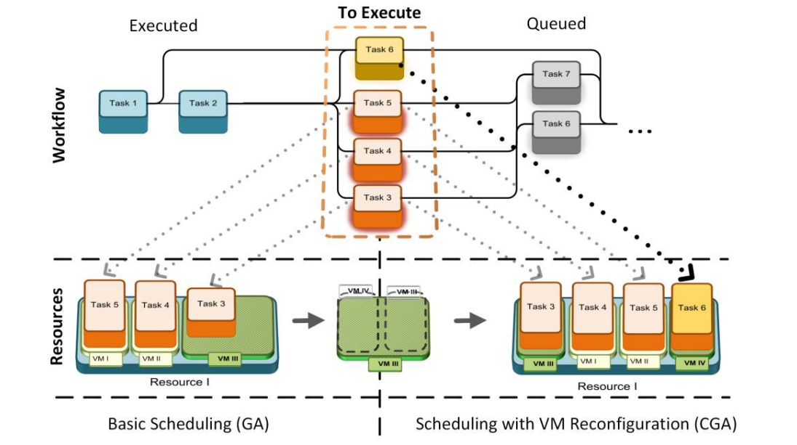

Workflow exeuciton simulator with different heuristic (HEFT, PEFT) and evolution (GA, PSO, GSA, SA) algorithms.
The project include discrete-event based simulator of cloud infrastructure that allow to build experiment under scheduling of scientific workflows.

Coevolution scheme:

The results are used in many publications:
https://www.scitepress.org/Papers/2015/55994/55994.pdf
https://www.sciencedirect.com/science/article/pii/S1877050915034067/pdf?md5=af414f1d728006e13829a97e50acebc0&pid=1-s2.0-S1877050915034067-main.pdf&_valck=1
https://link.springer.com/chapter/10.1007/978-3-319-07995-0_9
https://www.sciencedirect.com/science/article/pii/S1877050916310195/pdf?md5=51aeb8fd8df6929623b7d6e2406091b6&pid=1-s2.0-S1877050916310195-main.pdf&_valck=1
https://www.sciencedirect.com/science/article/abs/pii/S0167739X1730540X
...
